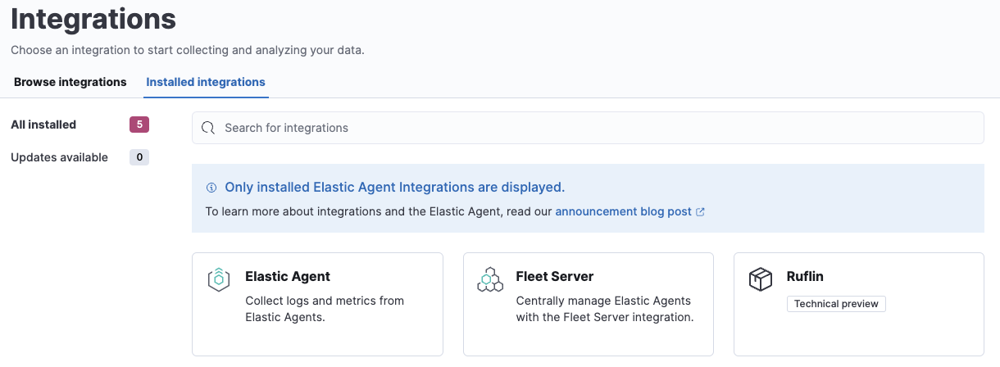

# Build your own integration package

The following is a quick guide on how you can build your own integration package and upload it to Kibana. This is all based on the Elastic Stack 8.8.0-SNAPSHOT version which is not released now and things might change along the way.

The integration package we are building is called `ruflin` and we are adding a `logs` dataset. The same could be done for a `metrics` dataset but often for the metrics use case a custom input is needed which would make the example here more complicated.

More details on how to build integrations can be found in the [Elastic integrations repo](https://github.com/elastic/integrations), especially the [Contributor docs](https://github.com/elastic/integrations/blob/main/CONTRIBUTING.md).

*Note: This is a temporary repository and might disappear at any time*

## Build the `ruflin` package

In the following steps we build the package which is also shared in this Github repository. The `git` part is not mentioned in the guide but I use it to version all the files on my end.

[elastic-package](https://github.com/elastic/elastic-package) is the tool used for building packages and it is assumed to be installed on your machine for everything below to work.

### Step 1: Create package

First lets create an empty package with all the necessary bits. Run the following command and answer the questions accordingly:

```bash
elastic-package create package
```

Details I used: 

* Package name: ruflin
* Version: 0.0.1
* License: Elastic-2.0
* Package Title: "Ruflin's great package"
* Descritption: "Ruflin package to collect logs"
* Categories: Custom
* Kibana version: ^8.6.1
* Subscritption: Basic
* Github owner: ruflin

For the next steps, change into the package directory, in my case `cd ruflin`.

Note: I renamed the top directory to `ruflin_package` manually to be able to push it to my Github repository without creating any confusion.

You can validate that the package was correctly created by running the following to commands:

```bash
# Check linting rules for packages
elastic-package lint
# Format package to fix linting
elastic-package format
# Builds `.zip` file out of the package assets
elastic-package build
```

If you want to run all three commands in one, you can use check:

```bash
elastic-package check
```

In the `build` directory under `{packagename}` the zip file of your package can be found. This a valid package but does not contain much functionality yet.

### Step 2: Test upload package to Kibana

To demo that our package can be installed into Kibana, a cluster needs to spin up. For this we need to have a running Docker setup and then run the following command:

```bash
elastic-package stack up --version=8.8.0-SNAPSHOT -v
```

This will spin up a cluster with the 8.8.0-SNAPSHOT builds. The cluster can be accessed under `https://localhost:5601` with username `elastic` and password `changeme`.

In case you want to update to the latest snapshot version, run `elastic-package stack update --version=8.8.0-SNAPSHOT -v`.

Open a second terminal window and run the following command:

```
elastic-package install
```

This will build and install the package directly into the local Kibana instance. After you run the above command, the package will show up under "[Installed integrations](https://localhost:5601/app/integrations/installed)" in Kibana.




### Step 3: Create a dataset

For now, we have built a package but it does not contain any assets. For the goal of starting to collect logs, we must create a dataset and for it the Elasticsearch mappings and ingest pipelines. If we want to be able to collect data through a managed Elastic Agent, we also need to add agent policy template.

The first step is to create a new dataset:

```bash
elastic-package create data-stream
```

The details I used:

* Data stream name: log
* Data stream title: My Log lines
* Type: logs

If you pick `log` as data stream name, the dataset is called `ruflin.log` and the final data stream created will be `logs-ruflin.log-default` as an example. Naming is slightly confusing here.

The above created all the boilerplace you need under `data_stream/log` directory.

To not have to worry about mappings, we pull in all the ECS fields. This can be done by creating the file `_dev/build/build.yml` under the root directory and add the following content:

```yaml
dependencies:
  ecs:
    reference: git@v8.6.0
    import_mappings: true
```

We also need to update `format_version: 2.3.0` in the `manifest.yml` file (will be removed with [#elastic/elastic-package/pull/1152](https://github.com/elastic/elastic-package/pull/1152)). This will import all ECS mappings fro 8.6.0 as dynamic templates. The alternative would be to add all fields manually.

Note: This is a new feature in elastic-package (see [#elastic/integrations/issues/5055](https://github.com/elastic/integrations/issues/5055) for more details) and might eventually become the default. TODO: Generation should use the newest format always.

We can frequently check with `elastic-package check` to make sure we didn't make any mistake and our package still builds and works.

If you upload the package now to Kibana, it will install reinstall the package and create mapping templates for `logs-ruflin.log-*`. You can add your own mappings under `data_stream/log/fields/fields.yml` if needed.

### Step 4: Add processing

We can already ship log files to `logs-ruflin.log-default` but no processing will happen. We would like to at least extract the timestamp and log level from the log lines. The log lines we collect will look as following:

```
2023-02-21T13:44:56.657+0100 INFO Hello world
2023-02-21T13:45:56.657+0100 INFO This is a nice day
2023-02-21T13:46:56.657+0100 INFO Nicolas is working on stuff
```

Each line of the log file will be shipped by Elastic Agent as a document with the `message` field containing the log line. We will use the [dissect processor](https://www.elastic.co/guide/en/elasticsearch/reference/current/dissect-processor.html) to take the log line apart into `@timestamp`, `log.level` and `message`.

To first test our ingest pipeline, we use the [simulate API](https://www.elastic.co/guide/en/elasticsearch/reference/current/simulate-pipeline-api.html):

```
POST /_ingest/pipeline/_simulate
{
  "pipeline" :
  {
    "description": "logs-ruflin.log",
    "processors": [
      {
        "dissect" : {
          "field" : "message",
          "pattern" : "%{@timestamp} %{log.level} %{message}"
        }
      }
    ]
  },
  "docs": [
    {
      "_index": "index",
      "_id": "id",
      "_source": {
        "message": "2023-02-21T13:46:56.657+0100 INFO Nicolas is working on stuff"
      }
    }
  ]
}
```

This returns:

```json
{
  "docs": [
    {
      "doc": {
        "_index": "index",
        "_id": "id",
        "_version": "-3",
        "_source": {
          "message": "Nicolas is working on stuff",
          "log": {
            "level": "INFO"
          },
          "@timestamp": "2023-02-21T13:46:56.657+0100"
        },
        "_ingest": {
          "timestamp": "2023-02-21T11:45:11.492622667Z"
        }
      }
    }
  ]
}
```

Now that we know the ingest pipeline is working, we add it to our dataset my modifying `data_stream/log/elasticsearch/ingest_pipline/default.yml` to:

```yaml
---
description: Pipeline for processing ruflin logs
processors:
- dissect:
    field: message
    pattern: "%{@timestamp} %{log.level} %{message}"
on_failure:
- set:
    field: error.message
    value: '{{ _ingest.on_failure_message }}'
```

Now run `elastic-package check` again and upload the package. It will install our new ingest pipeline. To test the new pipeline, we do a quick test run:

```
POST logs-ruflin.log-default/_doc
{
  "message": "2023-02-21T13:46:56.657+0100 INFO Nicolas is working on stuff"
}

GET logs-ruflin.log-default/_search
```

This will return the dissected message document. We are ready to ingest data.

## Step 5: Release a new version

Since our initial `0.0.1` version of the package, many modifications have been made. To build a new package version, we modify the `manifest.yml` and change `version: 0.2.0`. In addition, we need to add an entry to the `changelog.yml` file:

```yaml
- version: "0.2.0"
  changes:
    - description: Added ruflin log processing pipeline
      type: enhancement
      link: http://fake-link
```

Run `elastic-package check` again and the `elastic-package install` command. The `0.1.0` version of the package will be updated to version 0.2.0. Only 1 version of the same package can be installed at the same time. But like this different versions of a package can be rolled out over time.


## Step 6: Ingest data

To ingest data, we have 2 different ways: Elastic Agent standalone or Elastic Agent managed by Fleet. We start with standalone as for this we don't need any additional changes to the integration package.

First step is to [download Elastic Agent](https://www.elastic.co/downloads/elastic-agent). We update the elastic-agent config to the following:

```yaml
inputs:
  - type: logfile
    streams:
      - data_stream:
          # This must be aligned with the dataset name given
          dataset: test-ruflin.log
        paths:
          # Path to your log file
          - /Users/ruflin/Downloads/test-ruflin.log

outputs:
  default:
    type: elasticsearch
    hosts: ["https://127.0.0.1:9200"]
    username: "elastic"
    password: "changeme"
    ssl.verification_mode: none
```

Make sure `paths` is adjusted to your filepath and `dataset` is set to the same value of your dataset in the package. Otherwise data will not be processed. We start now elastic-agent with `sudo ./elastic-agent -e`. This will pick up the log file, ship it to Elasticsearch and process it with the ingest pipeline.

To make it more intuitive directly through Fleet, the file `data_stream/log/agent/stream/stream.yml.hbs` and the `data_stream/log/manifest.yml` to provide the correct configs to the policy editor. The files in the package are adjusted, just not part of the guide itself.

*Note: The same can be done through Custom log, just more complicated and not with defaults. Create a policy with the custom log input integration, add the path and set the dataset (under advanced) to the correct value and enroll your elastic-agent. Data starts to be shipped.*

## Done

You have now your own integration package that you can update with new features and ship to an Elastic Stack / share with others.

Many more assets can be added to an integration like dashboards. For this, check the [integrations contributor guide](https://github.com/elastic/integrations/blob/main/CONTRIBUTING.md).


## Links

* [Integrations contributor guide](https://github.com/elastic/integrations/blob/main/CONTRIBUTING.md)
* Uploading zip packages to Fleet: https://github.com/elastic/kibana/issues/148599
* Dynamic template support for ECS in packages: https://github.com/elastic/integrations/issues/5055


# Appendix

## Ideal Elastic Agent config

The current Elastic Agent config is more complicated then it should be. Ideally it would look something like the following:

```yaml
inputs:
- type: logfile
  data_stream.dataset: test-ruflin.log  
  paths:
    - /Users/ruflin/Downloads/test-ruflin.log

outputs:
  default:
    type: elasticsearch
    hosts: ["https://127.0.0.1:9200"]
    username: "elastic"
    password: "changeme"
    ssl.verification_mode: none
```


## Filebeat config

Same ingestion can be done with Filebeat: 

```yaml
filebeat.inputs:
- type: log
  paths:
    - test-ruflin.log

  # It is important to get the full index name correct
  index: logs-test-ruflin.log-default

output.elasticsearch:
  hosts: ["localhost:9200"]
  protocol: "https"

  username: "elastic"
  password: "changeme"
  ssl.verification_mode: none
```
